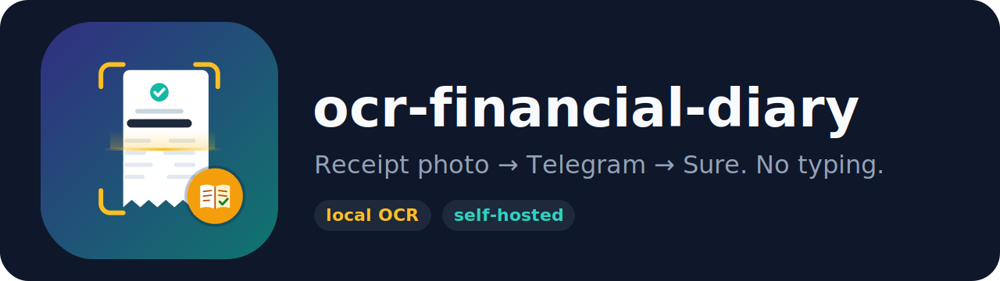
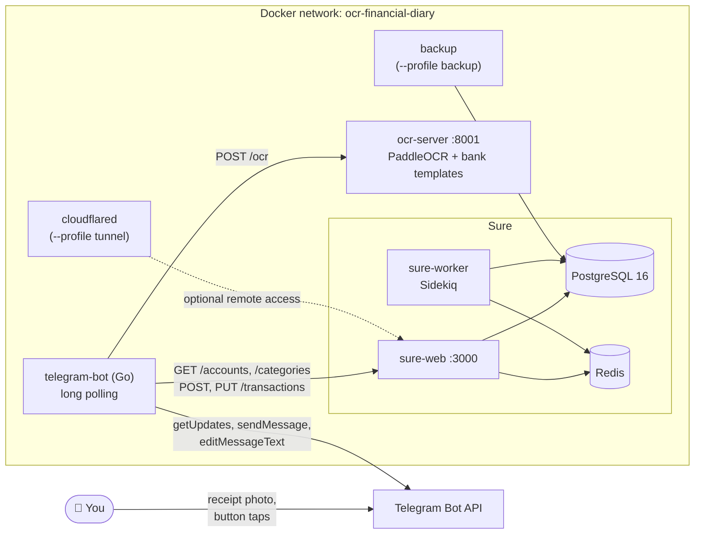
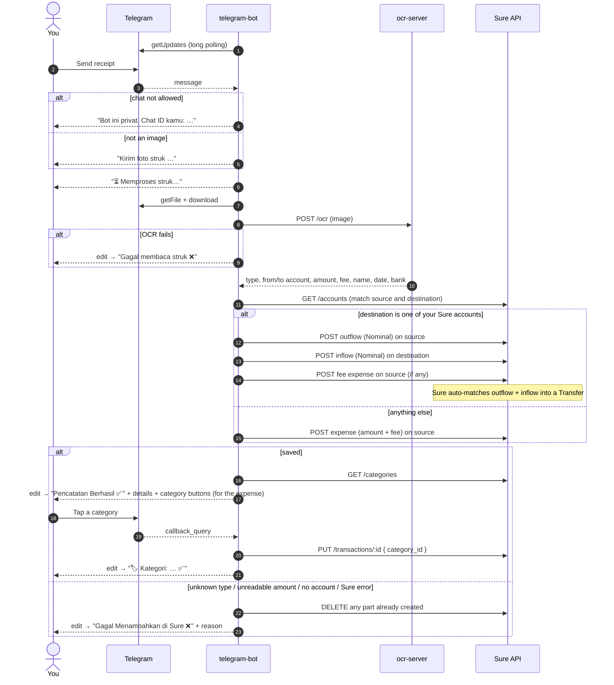
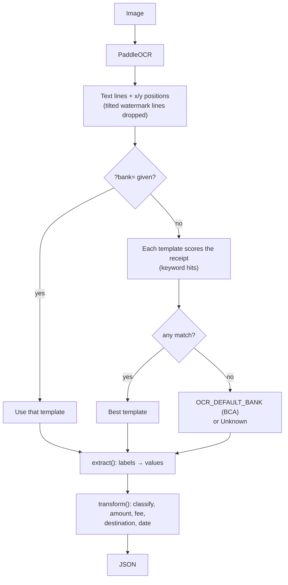
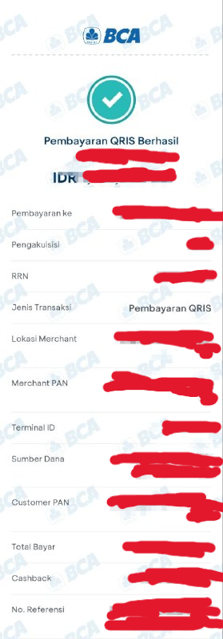

<p align="center">
  
</p>

# ocr-financial-diary

## Why tho? 🤔

Logging every transaction by hand? Not it. Open app → pick account → type amount → type name →
pick category… for every single coffee. I'm lazy, and I'd give up by day 3. 💀

But my banking app already makes a receipt with all of that on it. So now I just **share the
receipt to a Telegram bot**, and it lands in [Sure: The personal finance app for everyone](https://github.com/we-promise/sure): amount,
date, account, fee, the whole thing. One tap for the category. Done. ✨

### Who's it for?

- 🦥 **Lazy (or busy) people**: share → tap → done. Catching up on a week of receipts? The real
  dates are kept, no stress.
- 🔒 **Privacy people**: self-host it. OCR runs locally using [PaddleOCR](https://github.com/PaddlePaddle/PaddleOCR), [Sure: The personal finance app for everyone](https://github.com/we-promise/sure) is yours, and no random cloud reads your
  bank stuff.
- 🏦 **Banks with no auto-sync**: every banking app can make a receipt, so no bank API needed.
- 👨‍👩‍👧 **Households and small teams**: several people, one bot, one Sure.
- 🛠️ **Tinkerers**: adding your bank is one small Python file.

> **Heads up:** the receipt image does pass through Telegram on its way to your bot. Lock the bot to
> your own chat with `TELEGRAM_ALLOWED_CHAT_IDS` and host it somewhere you trust.

## Features

- 📸 **Receipt → transaction**: send a receipt as a photo or an image file
- 🗓️ **Real transaction date**: uses the date and time printed on the receipt, not the day you send it
- 💸 **Admin fees included**: the transfer fee (e.g. BI-FAST Rp2.500) is read from the receipt, so what Sure records matches what left your account
- 🔁 **Transfers between your own accounts**: when the destination is also one of your Sure accounts, it becomes a Sure **Transfer**, and only the admin fee counts as an expense
- 🏷️ **One-tap categories**: after saving, the bot shows one button per Sure category
- 🏦 **Pluggable bank templates**: BCA (myBCA) and BNI (wondr) today; add a bank by adding one Python file
- 🧹 **Watermark-proof**: the diagonal bank-logo watermarks behind receipt text are ignored
- 🔒 **Private**: only chat IDs you allow can use the bot
- 🪶 **Small bot**: Go, standard library only, ~10 MB image, ~2 MB RAM idle
- 💬 **Clear replies** for every outcome: saved, OCR failed, unknown receipt, no matching account, Sure error

## Architecture



| Service | Folder | Port | Role |
|---|---|---|---|
| `bot` | [`telegram-bot/`](telegram-bot) | 8080 (health, internal) | Receives photos, calls `ocr-server`, creates the Sure transaction, shows and applies category buttons |
| `ocr-server` | [`ocr-server/`](ocr-server) | 8001 (localhost only) | Reads the image with PaddleOCR, picks a bank template, returns structured JSON |
| `sure-web`, `sure-worker`, `db`, `redis` | — | 3000 | Sure (`ghcr.io/we-promise/sure:0.7.1`) |
| `backup` | `sure/backups/` | — | Optional daily Postgres backups |
| `cloudflared-finance` | — | — | Optional Cloudflare tunnel, e.g. to reach Sure from outside |

### How a receipt is processed



### How the OCR server reads a receipt



Supported today:

| Bank (app) | Template | Transaction types |
|---|---|---|
| **BCA** (myBCA) | [`templates/bca.py`](ocr-server/receipt_parser/templates/bca.py) | Transfer VA, Transfer Domestik, Transfer Antar Bank, QRIS, PLN |
| **BNI** (wondr) | [`templates/bni.py`](ocr-server/receipt_parser/templates/bni.py) | Transfer Antar Bank (tested); Transfer Domestik to another BNI account (untested) |

**BCA (myBCA)**

| Type | Recognised when "Jenis Transaksi"… | Name | Amount | Also |
|---|---|---|---|---|
| Transfer VA | is a BCA Virtual Account, or "Nama Produk" is a merchant/e-wallet (TOKOPEDIA, OVO, DANA, GOPAY, …) | Nama Produk (e.g. `SHOPEEPAY`), else Nama | Total Bayar → billdesc → Total Tagihan | |
| Transfer Domestik | contains "Transfer" and "BCA" | Nama Penerima | Nominal Tujuan (or Nominal) | Berita, fee = Biaya, destination = Rekening Tujuan (bank BCA) |
| Transfer Antar Bank | contains "Transfer", not "BCA" | Nama Penerima | Nominal | Berita, fee = Biaya, destination = No. Rekening Tujuan + Bank Tujuan |
| QRIS | contains "QRIS" | Pembayaran ke | Total Bayar → Nominal | RRN |
| PLN | "Jenis Produk PLN" contains PLN | Jenis Produk PLN | RP BAYAR | |

**BNI (wondr)**

Detected by "wondr" / "by BNI" and the wondr labels (BIZ ID, Metode transfer, Biaya transaksi).
The receipt is split into its sections: *Penerima* (name, then `BANK · account`), *Sumber dana*
(name, then the masked account) and *Detail transfer* (label left, value right).

| Type | Recognised when… | Name | Amount | Also |
|---|---|---|---|---|
| Transfer Antar Bank | title contains "Transfer" and the recipient bank isn't BNI | Penerima name | Nominal | Catatan / Berita if present, fee = Biaya transaksi, destination = Penerima `BANK · account` |
| Transfer Domestik | same, recipient bank is BNI | Penerima name | Nominal | Catatan / Berita if present, fee = Biaya transaksi, destination = Penerima `BANK · account` |

The raw fields also include the recipient bank and account, Biaya transaksi, Total, Metode
transfer (e.g. BI-FAST), Ref ID and BIZ ID (see `/ocr?debug=true`).

**Transfer fees.** For transfers, `amount` is the transferred amount (Nominal) and `fee` is the
admin fee (`null` when the receipt shows none). For a transfer to someone else the bot records
one expense of **amount + fee**, shows both in the reply (`Jumlah`, `Biaya`, `Total`) and notes
the split, e.g. `Transfer Antar Bank · Nominal Rp100.000 + Biaya Rp2.500`. For a transfer to your
own account the fee becomes its own expense (see below). If a fee is printed but can't be read,
the receipt is rejected rather than saved with a wrong total.

**Transfers to your own accounts.** Transfer receipts also return the destination account
(`to_account`, digits only, printed in full on the receipt, and `to_bank`). The bot compares it
with your Sure account names, treating each `*` in a name as one hidden digit, so
`BCA 123-4**-**90` matches `1234567890` and `BNI *******789` matches any 10-digit number ending
in `789`. When exactly one other Sure account matches, the bot records:

| | Sure account | Amount | Becomes in Sure |
|---|---|---|---|
| Outflow `Transfer ke <destination>` | source | Nominal | one side of a **Transfer** |
| Inflow `Transfer dari <source>` | destination | Nominal | the other side of the **Transfer** |
| `Biaya transfer ke <destination>` (only if there is a fee) | source | fee | an **expense** |

Sure's API can't create transfers directly (its transfers endpoint is read-only in 0.7.1), but Sure
automatically pairs an outflow and an inflow with the **same amount** on two of your accounts
within 4 days into a Transfer. That's why both sides use the Nominal and the fee is separate. In
Sure the pair shows as **Auto-matched**; confirm it with ✓. Transfers don't count as income or
spending, so only the fee shows up as an expense.

All transactions use the receipt date. The reply adds a "🔁 Transfer ke rekening sendiri" block,
and the category buttons apply to the fee (a fee-less own transfer gets no buttons). If any part
can't be created, the parts already created are deleted again, so Sure never holds half a transfer.
If the destination matches more than one Sure account, the bot records a normal expense and says why.

Every receipt also yields the source account (Dari Rekening / Sumber Dana) and the transaction
date and time from the header line, e.g. `15 Jan 2026 12:30:45` or `15 Jan 2026 · 12:30:45 WIB` → `2026-01-15`, interpreted as WIB
(UTC+7). English and Indonesian month names both work.

## Repository layout

```
.
├── docker-compose.yaml
├── .env.example                 # all settings; copy to .env
├── assets/                      # images used in this README
├── telegram-bot/                # Go bot (see telegram-bot/README.md)
│   ├── main.go                  # config, polling loop, health, shutdown
│   ├── bot.go                   # message and button handlers
│   ├── receipt.go               # OCR result → transaction, reply text, buttons
│   ├── telegram.go, ocr.go, sure.go
│   └── Dockerfile               # static binary on scratch
└── ocr-server/                  # Python / FastAPI / PaddleOCR
    ├── ocr-server.py            # API: /ocr, /banks, /health
    ├── receipt_parser/          # bank-agnostic parsing
    │   ├── base.py, registry.py, layouts.py, normalize.py, output.py
    │   └── templates/           # one file per bank (bca.py, bni.py) + how-to README
    ├── tests/
    └── model/                   # PaddleOCR models (git-ignored, mounted at runtime)
```

## Setup

### Requirements

- Docker with Docker Compose v2
- A Telegram bot token from [@BotFather](https://t.me/BotFather)
- **RAM:** the OCR server needs about **2.2 GB per worker** (measured with the bundled
  `PP-OCRv6_medium` models); Sure needs roughly another 1 GB. Plan for **4 GB** with one
  OCR worker (see *OCR workers* below). On 2 vCPU a receipt takes about 7 seconds.

### 1. Get the code and the OCR models

```bash
git clone <this repo> ocr-financial-diary && cd ocr-financial-diary
```

The OCR models are not in git (`ocr-server/model/` is git-ignored, ~180 MB). The folder is
mounted into the container at `~/.paddlex/official_models`, where PaddleOCR looks for them.
It must end up like this:

```
ocr-server/model/
├── PP-OCRv6_medium_det/          # text detection         ~60 MB
├── PP-OCRv6_medium_rec/          # text recognition       ~74 MB
├── PP-LCNet_x1_0_doc_ori/        # page orientation       ~7 MB
├── PP-LCNet_x1_0_textline_ori/   # text-line orientation  ~7 MB
└── UVDoc/                        # page unwarping         ~31 MB (only if OCR_DOC_UNWARPING=true)
```

Each folder holds `inference.json`, `inference.pdiparams` and `inference.yml` (plus
`config.json` for the three smaller models). They are published on Hugging Face under
[`PaddlePaddle/<folder name>`](https://huggingface.co/PaddlePaddle). Pick one way to get them:

**Option A: curl (simplest, nothing to install)**

Every file is a plain download from
`https://huggingface.co/PaddlePaddle/<model>/resolve/main/<file>`:

```bash
for m in PP-OCRv6_medium_det PP-OCRv6_medium_rec PP-LCNet_x1_0_doc_ori PP-LCNet_x1_0_textline_ori UVDoc; do
  mkdir -p "ocr-server/model/$m"
  for f in inference.json inference.pdiparams inference.yml config.json; do
    curl -fsSL --retry 3 -o "ocr-server/model/$m/$f" \
      "https://huggingface.co/PaddlePaddle/$m/resolve/main/$f" \
      && echo "ok       $m/$f" \
      || { rm -f "ocr-server/model/$m/$f"; echo "skipped  $m/$f (not in this model)"; }
  done
done
```

`config.json` only exists for the three small models, so it is "skipped" for the two
`PP-OCRv6_medium_*` models; that's expected.

On Windows (PowerShell; `curl.exe` ships with Windows 10 and later):

```powershell
$models = "PP-OCRv6_medium_det","PP-OCRv6_medium_rec","PP-LCNet_x1_0_doc_ori","PP-LCNet_x1_0_textline_ori","UVDoc"
foreach ($m in $models) {
  New-Item -ItemType Directory -Force "ocr-server/model/$m" | Out-Null
  foreach ($f in "inference.json","inference.pdiparams","inference.yml","config.json") {
    curl.exe -fsSL --retry 3 -o "ocr-server/model/$m/$f" "https://huggingface.co/PaddlePaddle/$m/resolve/main/$f"
    if ($LASTEXITCODE -ne 0) { Remove-Item -ErrorAction SilentlyContinue "ocr-server/model/$m/$f" }
  }
}
```

**Option B: Hugging Face CLI**

```bash
pip install -U "huggingface_hub[cli]"
for m in PP-OCRv6_medium_det PP-OCRv6_medium_rec PP-LCNet_x1_0_doc_ori PP-LCNet_x1_0_textline_ori UVDoc; do
  hf download "PaddlePaddle/$m" --local-dir "ocr-server/model/$m"
done
```

On older `huggingface_hub` versions the command is `huggingface-cli download` instead of `hf download`.

On Windows (PowerShell):

```powershell
pip install -U "huggingface_hub[cli]"
"PP-OCRv6_medium_det","PP-OCRv6_medium_rec","PP-LCNet_x1_0_doc_ori","PP-LCNet_x1_0_textline_ori","UVDoc" |
  ForEach-Object { hf download "PaddlePaddle/$_" --local-dir "ocr-server/model/$_" }
```

**Check**

```bash
ls ocr-server/model/*/inference.pdiparams     # five files (four without UVDoc, which is optional)
du -sh ocr-server/model/*                     # sizes as above; a few KB means a failed LFS download
```

### 2. Configure

```bash
cp .env.example .env
```

All settings live in this one root `.env`; `docker-compose.yaml` passes each one to the
service that needs it. The services have no `.env` files of their own.

**`.env`**

| Variable | Required | Description |
|---|---|---|
| `TELEGRAM_BOT_TOKEN` | ✅ | Bot token from @BotFather |
| `SURE_API_KEY` | ✅ | Create it in Sure after first start (step 4) |
| `TELEGRAM_ALLOWED_CHAT_IDS` | recommended | Comma-separated chat IDs allowed to use the bot. Empty = anyone |
| `POSTGRES_USER`, `POSTGRES_PASSWORD`, `POSTGRES_DB` | | Sure database |
| `SECRET_KEY_BASE` | | `openssl rand -hex 64`. Set it once and **never change it**: Sure's sessions and encrypted data depend on it |
| `SURE_API_URL` | | Default `http://sure-web:3000/api/v1` |
| `MAX_CONCURRENT_OCR` | | Receipts processed at the same time (default `1`) |
| `OPENAI_ACCESS_TOKEN` | | Optional, enables Sure's AI features (costs money) |
| `PORT` | | Sure's port on the host (default `3000`) |
| `CLOUDFLARE_TOKEN` | | Only with `--profile tunnel` |

**OCR server** (optional, same `.env`)

| Variable | Default | Description |
|---|---|---|
| `OCR_DEVICE` | `cpu` | `cpu` or `gpu`. The Docker image installs the CPU build of PaddlePaddle |
| `OCR_LANG` | `id` | PaddleOCR language |
| `OCR_DEFAULT_BANK` | `BCA` | Template used when no bank is recognised; set it empty (`OCR_DEFAULT_BANK=`) for `Unknown` |
| `OCR_DOC_UNWARPING` | `false` | Page unwarping (UVDoc) for photos of paper. Keep it off for app screenshots: it crops the left edge of the image |
| `OCR_LOG_LEVEL` | `INFO` | `INFO` or `DEBUG` |
| `BOT_LOG_LEVEL` | `info` | Telegram bot log level: `info` or `debug` |

**OCR workers:** `ocr-server/Dockerfile` starts gunicorn with `--workers 4`, and each worker
loads its own copy of the models (~2.2 GB each). Unless the machine has plenty of RAM, change it
to `--workers 1`: the bot sends one receipt at a time anyway (`MAX_CONCURRENT_OCR=1`).

### 3. Start

```bash
docker compose up -d --build
docker compose ps          # wait until ocr-server is healthy
```

Optional extras:

```bash
docker compose --profile backup up -d   # daily Postgres backups into ./sure/backups
docker compose --profile tunnel up -d   # Cloudflare tunnel (CLOUDFLARE_TOKEN)
```

### 4. Set up Sure

1. Open `http://<server>:3000` and create your account.
2. Create an API key in Sure's settings, put it in `.env` as `SURE_API_KEY`, then run
   `docker compose up -d bot`.
3. **Name each account so it contains the account number as the bot reads it** (see
   *Sure account naming* below). ⚠️ The naming rules below currently cover **BCA (myBCA)** and
   **BNI (wondr)** receipts only.
4. Create the categories you want. The bot lists all of them alphabetically (up to 98).

#### Sure account naming

> ⚠️ **These naming rules only work for BCA (myBCA) and BNI (wondr) receipts**, the two bank
> templates so far. Each app prints and masks the source account differently, so each has its
> own rule below. Other banks and apps are not supported yet; each will need its own template
> and naming rule.

**How matching works:** the bank template reads the source account printed on the receipt
and turns it into `from_account`. A Sure account matches when its name **contains**
`from_account` (case-insensitive). So each Sure account name must include `from_account` exactly
as that bank's template produces it.

Convention: **`<Bank> <product or owner, optional> <from_account>`**

How `from_account` looks depends on the bank and app, because each prints (and masks) the
account differently. Each bank template documents its own format below; when support for a new
bank is added, add its section here too.

##### BCA (myBCA)

The source account is "Dari Rekening", or "Sumber Dana" on QRIS receipts. myBCA masks the
middle digits; the template keeps the mask but removes spaces and any text before the first digit.

| Receipt shows | `from_account` | Sure account name (example) |
|---|---|---|
| Dari Rekening `123 - 4** - **89` | `123-4**-**89` | `BCA 123-4**-**89` |
| Sumber Dana `TAHAPAN XPRESI` / `555 - 1** - **02` | `555-1**-**02` | `BCA Tahapan Xpresi 555-1**-**02` |
| Dari Rekening `987 - 6** - **21` (another person) | `987-6**-**21` | `BCA John 987-6**-**21` |

- Keep the mask exactly as written, with `-` and `*` and no spaces (`123-4**-**89`, not
  `123 - 4** - **89` or `1234**89`).
- Every myBCA receipt from the same account masks it the same way, so one name covers all of
  them. Two accounts that share the same mask (same first 4 and last 2 digits) can't be told
  apart; the first matching account is used.
- Receipts from other BCA channels (KlikBCA, ATM, older m-BCA) may print the account
  differently; check the bot's reply for the exact `from_account`.

##### BNI (wondr)

The source account is the second line under "Sumber dana". wondr shows only the last 3 digits
(`*******789`); the template keeps it exactly like that, stars included.

| Receipt shows | `from_account` | Sure account name (example) |
|---|---|---|
| Sumber dana `JOHN DOE` / `*******123` | `*******123` | `BNI *******123` |
| Sumber dana `JANE DOE` / `*******456` (another person) | `*******456` | `BNI Jane *******456` |

- Include all the stars: `BNI *******123`, not `BNI 123` or `BNI ***123`.
- Only 3 digits are visible, so two BNI accounts ending in the same 3 digits can't be told apart.
- Don't put a BNI-style mask (`*******123`) in the name of an account at another bank.

##### Own-account transfers

The same names are used to recognise a transfer **to** one of your accounts: the receipt shows the
destination number in full, and it matches when it fits the name's pattern (digits must be equal,
`*` matches any digit, same length). So `BCA 123-4**-**90` already works as a destination. You can
also put the full number in the name (e.g. `Mandiri 1234567890123`). Make sure two of your accounts
never share a pattern that fits the same number.

##### Tips for every bank

- Not sure what `from_account` is? Send the receipt anyway: the success reply shows it on the
  "Dari Rekening" line, and the "tidak ada akun Sure yang cocok" error quotes it.
- Avoid account names that are only digits or very short (e.g. `12`): a name that is *contained
  in* `from_account` also counts as a match.

### 5. Allow your Telegram chat

Send the bot any message. If your chat isn't allowed yet, it replies:

```
Bot ini privat. Chat ID kamu: 123456789
```

Add that number to `TELEGRAM_ALLOWED_CHAT_IDS` in `.env` (comma-separated for more people or
groups), then:

```bash
docker compose up -d bot
docker compose logs bot | grep allowed_chats   # shows how many chats are allowed
```

For a **group**, the chat ID is negative (`-100…`). Also disable the bot's privacy mode in
@BotFather (`/setprivacy` → Disable), then remove and re-add the bot, otherwise Telegram doesn't
pass it photos.

### 6. Use it

Send a receipt photo by using share button/from the downloaded transaction receipt to your Telegram Bot. The bot replies with the saved transaction and category buttons.

For example, a myBCA QRIS payment receipt (values blurred) and the bot's reply:

<table>
<tr>
<th>Receipt you send</th>
<th>Bot reply</th>
</tr>
<tr>
<td valign="top"></td>
<td valign="top">

```
Pencatatan Berhasil ✅
Jenis: Transfer QRIS
Tanggal: 2026-01-15 12:30
Merchant: WARUNG ********
Jumlah: Rp45.000
Dari Rekening: 123-4**-**89

🏷 Pilih kategori:
[Food & Drink] [Groceries]
[Transport]    [Utilities]
[⏭ Tanpa kategori]
```

The bot reads *Pembayaran ke* (merchant), *Total Bayar* (amount), *Sumber Dana* (your account),
*RRN* and the date and time under the title. Tapping a category sets it on the transaction in
Sure and replaces the buttons with `🏷 Kategori: Food & Drink ✅`.

</td>
</tr>
</table>

A transfer with an admin fee shows the split:

```
Pencatatan Berhasil ✅
Jenis: Transfer Antar Bank
Tanggal: 2026-01-15 12:30
Tujuan: JOHN DOE
Jumlah: Rp100.000
Biaya: Rp2.500
Total: Rp102.500
Dari Rekening: 123-4**-**89
```

A transfer to one of your own Sure accounts is recorded as a Sure transfer plus the fee:

```
Pencatatan Berhasil ✅
Jenis: Transfer Antar Bank
…
Dari Rekening: *******123

🔁 Transfer ke rekening sendiri
Transfer Rp100.000: BNI *******123 → BCA 123-4**-**89
Biaya Rp2.500 dicatat sebagai pengeluaran

🏷 Pilih kategori:
…
```

In Sure, the two Rp100.000 sides appear as an **Auto-matched** transfer; confirm it with ✓.

Everyone allowed writes into the same Sure (one API key), so each person needs a Sure account
whose name matches their `from_account`.

## Operations

### Deploying changes

The code is baked into the images, so rebuild the service you changed:

| You changed | Run |
|---|---|
| `telegram-bot/**` | `docker compose up -d --build bot` |
| `ocr-server/**` | `docker compose up -d --build ocr-server` |
| `.env` | `docker compose up -d` (recreates the services whose settings changed) |

### Health and logs

```bash
docker compose ps                        # bot and ocr-server have health checks
docker compose logs -f bot               # every receipt: OCR result, transaction id, date, amount
curl -s localhost:8001/health            # ocr-server
curl -s -F "file=@receipt.jpg;type=image/jpeg" "localhost:8001/ocr?debug=true"   # raw OCR lines
```

### Troubleshooting

| Symptom | Cause / fix |
|---|---|
| "Bot ini privat. Chat ID kamu: …" | Add the ID to `TELEGRAM_ALLOWED_CHAT_IDS`, then `docker compose up -d bot` |
| Bot doesn't answer | `docker compose logs bot`. `409 Conflict` on `getUpdates` means another bot instance or a webhook uses the same token |
| "tidak ada akun Sure yang cocok" | No Sure account name contains the receipt's `from_account` (see *Set up Sure*) |
| "Gagal membaca struk ❌" | `ocr-server` down or still loading: `docker compose ps`, `docker compose logs ocr-server` |
| ocr-server exits or restarts | `OCR_DEVICE` must be `cpu`; not enough RAM (reduce `--workers`) |
| `unable to find user appuser` | Stale image: `docker compose build --no-cache ocr-server && docker compose up -d ocr-server` |
| No category buttons | No categories in Sure yet, or the Sure API key can't read them (check the bot log). An own-account transfer without a fee has nothing to categorize, so no buttons is expected |
| Own-account transfer saved as a normal expense | The destination number doesn't fit any Sure account name, or fits more than one (the reply says so). See *Own-account transfers* under *Sure account naming* |
| Own-account transfer not shown as a Transfer in Sure | Sure pairs the two sides automatically; open the account and confirm the **Auto-matched** pair with ✓. Delete older duplicates of the same receipt, or Sure may pair the wrong entries |
| A receipt is parsed wrongly | Look at `debug.lines` from `/ocr?debug=true` and adjust the bank template |

## Adding a bank

Follow [`ocr-server/receipt_parser/templates/README.md`](ocr-server/receipt_parser/templates/README.md):
create `templates/<bank>.py` with the bank's keywords and labels, pick the `two_column_kv`
(label left, value right) or `stacked_kv` (value below label) layout, and import it in
`templates/__init__.py`. Receipts made of titled blocks can be parsed section by section like
`bni.py`. For transfers, also return `fee` and the destination (`to_account`, `to_bank`) so fees
and own-account transfers work, and add the bank's rule to *Sure account naming*. Use
`/ocr?debug=true&bank=<id>` to see what the OCR reads.

## Development

```bash
# Go bot: Telegram, OCR and Sure are faked with httptest
cd telegram-bot && go test -race ./...

# End-to-end against a running ocr-server with a real receipt
OCR_E2E_URL=http://localhost:8001 OCR_E2E_IMAGE=/path/receipt.jpg \
OCR_E2E_ACCOUNT="BCA 123-4**-**89;BNI *******123" go test -run E2E -v   # ";" = several Sure accounts

# OCR parser unit tests (no model needed)
cd ocr-server && python -m unittest discover -s tests -t .

# Regression tests on your own receipts (kept outside the repo: they contain personal data)
RECEIPT_SAMPLES_DIR=/path/to/sample/bca python -m unittest tests.test_samples -v
```

The samples folder holds the images, their OCR output in `_ocr_cache/<image>.ocr.json` (so the
test runs without PaddleOCR) and an `expected.json` with the fields to check.

## Known limitations

- PLN amounts are not parsed into a number yet, so PLN receipts fail with "jumlah tidak terbaca".
- Sending the same receipt twice creates two transactions.
- Only the first 98 categories get buttons (Telegram allows 100 per message).
- The category can't be changed from Telegram after tapping; change it in Sure.

## Roadmap

- Templates for more banks and e-wallets (Mandiri, BRI, BSI, Jago, SeaBank, GoPay, DANA…), more BNI (wondr) transaction types
- Duplicate detection using the receipt's reference number
- Remember the category per merchant and show it first
- Smaller OCR models for low-memory servers

## License

[GPL-3.0](LICENSE)
